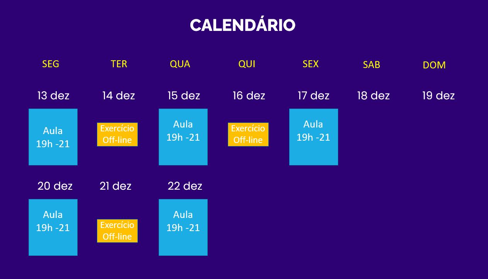

# Treinamento de Data Science Certsys
Material usado no curso de Data Science da Certsys 13 a 22 de dezembro de 2021

## 1 - Calendário

## 2 - Como instalar o Anaconda

Neste video eu mostro como instalar o Anaconda, a distribuição python mais popular para Data Science
https://youtu.be/VQtw7f24GzU

## 3 - Aula 1
Link para a gravação da Aula 1:
https://youtu.be/4TvNfJpIVpg

Assim que terminar de subir no Youtube vai estar neste link

## 4 - Exercicio 1 
O exercicio está na pasta exercicios 